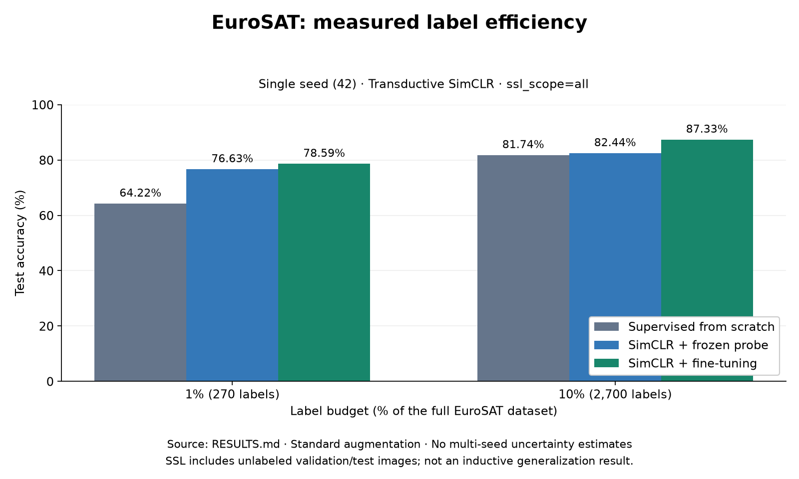

# LE-SatCLR

Label-efficient satellite land-cover classification. A ResNet-18 encoder is
pretrained with SimCLR on unlabeled EuroSAT images, then evaluated against a
from-scratch baseline at 1% and 10% label budgets.

**Single-seed, transductive evaluation:** seed 42, standard augmentation,
`ssl_scope=all`. SSL pretraining includes unlabeled validation and test images;
these results do not establish inductive or out-of-distribution generalization.
No multi-seed uncertainty estimates are available.

## Measured results

[RESULTS.md](RESULTS.md) records test accuracy of 78.59% at 1% labels and
87.33% at 10% labels for SimCLR fine-tuning: +14.37pp and +5.59pp over scratch
within this protocol.



Regenerate the figure directly from the primary table in `RESULTS.md`, without
images, checkpoints, or a Modal account:

```powershell
uv run --frozen python -m src.report --results-markdown RESULTS.md --figure docs/results.png
```

## Setup

```powershell
uv sync --frozen
```

You need a Modal account for training (`modal setup`) and `Dataset/EuroSAT_RGB`
with the 10 class folders for local training or dataset evaluation. Regenerating
the measured-results figure does not need the dataset.

```powershell
uv sync --frozen
uv run --frozen python -m src.report --results-markdown RESULTS.md --figure docs/results.png
```

## Training

Defaults resolve per stage (SimCLR 100/128, probe 50/64, fine-tune 75/64,
baseline 75/64) on A10G GPUs. Everything is detached, so you can close your
laptop.

```powershell
# 1. Self-supervised pretraining (one run, shared encoder)
uv run modal run --detach modal_app.py --stage simclr

# 2. Downstream: 1% and 10% apps in parallel, each running
#    probe -> fine-tune -> baseline from the same SSL checkpoint
uv run python launch_downstream.py --ssl-checkpoint /outputs/models/simclr_standard_unlabeled_seed42/<RUN_ID>/<ckpt>_best.pt
```

Single-stage runs and the satellite-augmentation ablation take the same flags
(`--stage`, `--label-percent`, `--policy satellite`, `--ssl-scope`).
`--max-batches` limits batches for quick checks only. Seed is fixed at 42;
splits are 21,600 train / 2,700 val / 2,700 test with nested 270/2,700-image
label subsets.

## Dashboard and inference

```powershell
# Full stack (API + frontend) with your local checkpoints
uv run python -m src.dashboard   # http://127.0.0.1:8000

# Single image, single command
uv run python -m src.infer --image Dataset/EuroSAT_RGB/SeaLake/SeaLake_1.jpg --checkpoint outputs/models/finetune_10pct_best.pt
```

The dashboard serves the newest checkpoint under `outputs/models/`, or
whatever `LE_SATCLR_CHECKPOINT` points at. Its model picker lists every
downloaded checkpoint, so 1% and 10% models can be evaluated side by side.

## Deploy

- Backend: `uv run modal deploy modal_app.py`. Pushes to `main` redeploy
  automatically via `.github/workflows/deploy-backend.yml` (needs
  `MODAL_TOKEN_ID` / `MODAL_TOKEN_SECRET` in the `production` environment).
- Frontend: import `web/` into Vercel (Vite preset) with
  `VITE_API_URL` set to the `dashboard-app` Modal URL.

## Layout

- `src/` — data splits, ResNet-18 + SimCLR models, training loop,
  reporting, dashboard API, inference CLI
- `modal_app.py` — Modal training jobs and the dashboard web endpoint
- `launch_downstream.py` — parallel 1%/10% launcher
- `web/` — React dashboard (Vite)
- `RESULTS.md` — measured numbers with run IDs and checkpoint paths
